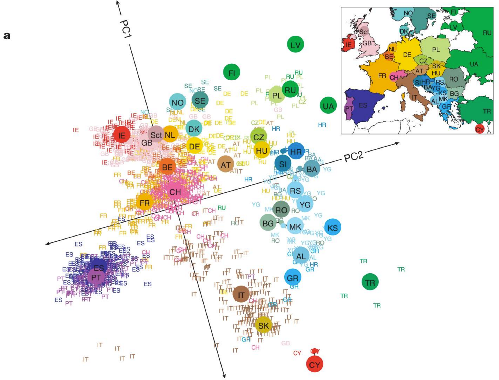
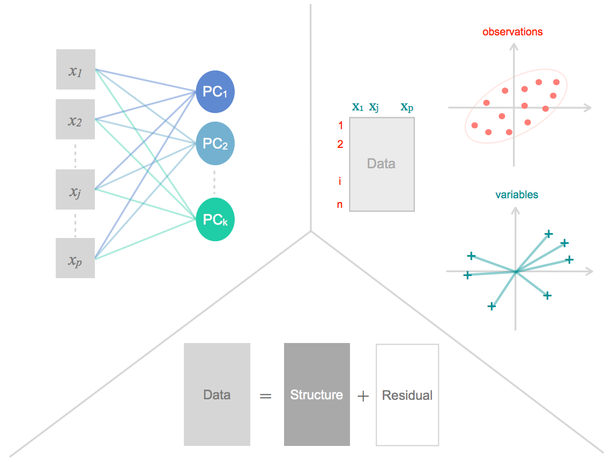

```{r load-project, echo = FALSE, results = 'hide', message = FALSE}
## Other libraries
library("limma")
library("edgeR")
library("ggplot2")
library("knitr")
library(magrittr)

## Define plotting theme
theme_set(theme_bw(12) +
              theme(legend.justification = c(0, 0), 
                    legend.position = c(0, 0), 
                    legend.title = element_text(6),
                    legend.text = element_text(size = 5)
              )
)

### knitr options ###
# opts_knit$set(root.dir = '~/Dropbox/Projects/021_Cell_Cycle')
opts_chunk$set(comment = NA, fig.align = 'center', dpi = 500, dev = 'svg',
               tidy = FALSE, results = 'show', echo = TRUE, 
               message = FALSE, cache = FALSE, eval = TRUE, warning = FALSE)
knit_hooks$set(par = function(before, options, envir) {
    if (before && options$fig.show != 'none') 
        par(mar = c(4.1,3.1,.1,.1), cex.lab = .95, cex.axis = .9, 
            mgp = c(2,.7,0), tcl = -.3)
})
```


## Preliminaries 

Get the session materials:

Get the session materials:

* **[Easiest]** Access locally on Training Room computer

Or: 

* Navigate your browser to: http://bit.ly/predocs_nov2015

* `git clone https://github.com/davismcc/embl_predocs_data_analysis_in_R_Nov2015` in your favourite folder

* Download `.zip` from https://github.com/davismcc/embl_predocs_data_analysis_in_R_Nov2015
or http://bit.ly/predocs_nov2015 and unzip in your favourite folder

* If you want the data separately, save the data at the link https://www.dropbox.com/s/nvzylmj8a5rc5jm/expression_processed.RData?dl=0
to the `data/` directory of the project folder (from above)


Once you're set up...

* Load `data_analysis_in_R_report.Rmd` in RStudio

* Follow/work though this session from that file

* Add your own notes and code as we go along


### Plan 

* Overview of linear models (talking; 15 mins)

* Fitting linear models to genomic data (doing; 35 mins)

* Overview of principal components analysis (talking; 15 mins)

* Fitting PCA to genomic data (doing; 35 mins)

* Combining PCA and linear models (doing; 20 mins)


### Objectives

Gain understanding and practical experience of:  

1. fitting one and many linear models to cancer gene expression data to perform 
statistical inference;

2. performing PCA and using it to inform statistical analyses.


# Today's data

## Iris data

```{r load-data}
data(iris)
head(iris, n = 5) %>% kable
```


## TCGA gene expression data

```{r load-tcga-data}
load("data/expression_processed.RData")
dim(expr)
expr[1:6, 1:2]
```


## TCGA gene expression data

```{r view-tcga-samples}
sample_info[1:3, 1:6]
sample_info[1:3, 7:10]
```

## A friendly reminder about R help...

A major advantage of using for data analysis R is that every function is 
documented.

So read the docs!! 

e.g. `> ?lm`

The examples can be particularly helpful.

Sometimes the docs will make absolutely no sense. 

There is no shame in asking Google, StackOverflow, or even actual living humans.


# Linear models in genomics

## Motivation 

We have gene expression data for 20,000 genes from 400 samples of normal and 
tumour tissue.

How do we find genes that are differentially expressed between normal and 
tumour tissue?


## Linear models are simple, efficient and well-understood*

And so linear models are very widely used in genomics:

* Differential expression studies (here)
* Genome-wide association studies (especially linear *mixed* models)
* The first analysis for any new study, data type...


`*` well...it's a broad church

## What is this session? 

**It is:**

* Frequentist, "classical" framework
* Fixed effects
* Focused on applications in R
* Simple (I hope)
* Intuitive (I hope)
* Useful (I hope)
* A platform to extend from


**It is not:**

* Bayesian
* "Mixed effects" models
* Sophisticated
* Mathematically advanced or rigorous
* Comprehensive
* Unenjoyable (I hope)

[I am a big fan of Bayesian and mixed effects methods, but can't cover them here]

## Linear model with a single predictor 

$$ Y_i = \beta_0 + X_{1i} \beta_1 + \epsilon_i $$

* $Y_i$ --- dependent variable (gene expression, phenotype, ...)
* $\beta_0$ --- intercept term ("overall average")
* $X_1$ --- independent variable or predictor (e.g. tumour/normal status)
* $\beta_1$ --- coefficient for predictor $X_1$
* $\epsilon_i$ --- error term; normally distributed with mean zero and constant
variance across samples


## Linear model with multiple predictors 

$$ Y_i = \beta_0 + x_{1i} \beta_1  + x_{2i} \beta_2 + \ldots + \epsilon_i $$

* $Y_i$ --- dependent variable (gene expression, phenotype, ...)
* $\beta_0$ --- intercept term ("overall average")
* $X_1$, ..., $X_k$ --- predictors (e.g. tumour status, gender, age, ...)
* $\beta_1$, ..., $\beta_k$ --- coefficient for predictors $X_1$, ..., $X_k$
* $\epsilon_i$ --- error term; normally distributed with mean zero and constant
variance across samples


## Linear model with a design matrix 

$$ Y = X \beta + \epsilon $$

* $Y$ --- an $n \times 1$ **column vector** of observed dependent variable values (gene expression, phenotype, ...)
* $\beta$ --- a $k \times 1$ **column vector** of coefficients
* $X$ --- an $n \times k$ **matrix** of predictors (e.g. tumour status, gender, age, ...)
* $\epsilon$ --- an $n \times 1$ vector of error terms; independent and identically 
normally distributed with mean zero and constant variance across samples

## Fitting a model 

We "fit the model" by finding **maximum likelihood estimates** of the parameters
$\beta$.

We can conduct hypothesis tests on the $\beta$ parameters and can compare 
different models in various ways to perform **inference** on the predictors.

We hope to use such inference to answer scientific questions like "which genes 
are significantly differentially expressed between tumour and normal tissue 
samples"?

## Our model for a gene 

$$ Y_g = X \beta + \epsilon $$

* $Y_g$ --- an $n \times 1$ **column vector** of measured gene expression values
* $\beta$ --- a $k \times 1$ **column vector** of coefficients
* $X$ --- an $n \times k$ **matrix** of predictors. 
We will try fitting just a 
single predictor (tumour/normal status) and then extend to multiple predictors 
(including type of cancer)
* $\epsilon$ --- an $n \times 1$ vector of error terms as usual

We generally work "one gene at a time" and fit the same (or very similar) model 
to each gene, even if analysing 20,000.

# Let's fit some linear models!

## Is TP53 differentially expressed? {.flexbox .vcenter}

A tumour suppressor -- the "guardian of the genome".


Image from [Bago Games](https://www.flickr.com/photos/bagogames/14224121994/)
(reproduced under [Creative Commons Licence](https://creativecommons.org/licenses/by/2.0/legalcode)) 

## Can we detect differential expression in TP53?

We will fit a model with a single predictor. 

Then fit models with multiple predictors.

Then think about model selection.

## Set up design matrix for TP53

```{r tp53-1pred}
p53_exprs <- expr["TP53",]
tumour <- factor(sample_info$Definition, 
                 levels = c("Solid Tissue Normal", 
                            "Primary solid Tumor", "Metastatic"))
design0 <- model.matrix(~tumour)
head(design0)
```

## Fit simplest model for DE 

```{r tp53-1pred-lmfit}
fit0 <- lm(p53_exprs ~ 0 + design0)
summary(fit0)
```


## Plot fit diagnostics

```{r tp53-1pred-diagnostics}
par(mfcol = c(2, 2))
plot(fit0, ask = FALSE)
```

## What about a more complicated model?

```{r tp53-2pred}
study <- factor(sample_info$Study.Abbreviation)
design1 <- model.matrix(~study + tumour)
head(design1)
```


## Results of the two-predictor model 

```{r tp53-2pred-summary}
fit1 <- lm(p53_exprs ~ 0 + design1)
summary(fit1)
```


## Model comparison: likelihood ratio test

Each model has a *likelihood*. We can compare the likelihoods of models in a 
particular way to decide which is better. The Neyman-Pearson lemma states that 
the *likelihood ratio test* (LRT) is the uniformly most powerful test for simple
hypotheses.

```{r tp53-lrt}
logLik(fit0)
logLik(fit1)
```


## Hypothesis testing: LRT

```{r tp53-lrt-2}
lr <- -2*(logLik(fit0)[1] - logLik(fit1)[1])
df <- fit0$df.residual - fit1$df.residual
pchisq(lr, df = df, lower.tail = FALSE)
anova(fit0, fit1, test = "LRT")
```

## Model comparison: AIC 

An alternative to the LRT that is in wide use is "Akaike's Information 
Criterion" (AIC). Essentially look for a model with high likelihood, but 
penalise the number of parameters in the model. Aim to *minimise* AIC.

```{r tp53-2pred-aic}
AIC(fit0, fit1)
```

## Model comparison: BIC 

Or we can use the **Bayesian Information Criterion** (BIC) in a similar way:

```{r tp53-2pred-bic}
BIC(fit0, fit1)
AIC(fit0, fit1, k = log(length(p53_exprs)))
```

AIC and BIC can be used for *non-nested models*, unlike LRT. 


## Stepwise model selection (backward)

```{r tp53-step-bwd, results = 'hide'}
sample_info$Cancer.Status <- ifelse(
    sample_info$Definition == "Solid Tissue Normal", "normal", "cancer") %>%
    factor(levels = c("normal", "cancer"))
names(sample_info)[-c(1:5, 7, 9:10)]
p53_df <- cbind(sample_info[, -c(1:5, 7, 9:10)], p53_exprs)
summary(fit_p53_full <- lm(p53_exprs ~ ., data = p53_df))
fit_p53_step_bwd <- step(fit_p53_full, direction = "backward")
summary(fit_p53_step_bwd)
fit_p53_step_bwd$anova
```

What is our selected model?

## Stepwise model selection (forward)


```{r tp53-step-fwd, results = 'hide'}
summary(fit_p53_null <- lm(p53_exprs ~ 1, data = p53_df))
fit_p53_step_fwd <- step(fit_p53_null, 
    p53_exprs ~ Source.Site + BCR + Study.Abbreviation + Cancer.Status, 
    direction = "forward")
summary(fit_p53_step_fwd)
fit_p53_step_fwd$anova
```

Do we select the same model as before?


## Do we get the same result using BIC?

```{r tp53-step-BIC, results = 'hide'}
fit_p53_step_bic <- step(fit_p53_full, k = log(length(p53_exprs)))
summary(fit_p53_step_bic)
fit_p53_step_bic$anova
```


## Extensions

* Can you fit and select a model for MYC instead of TP53? What do you conclude?
* Can you find another "significant" DE gene? Can you find at least one 
non-significant DE gene?
* How would you scale such an analysis up to all 20,502 genes in this data set?
* Do we need to adjust our inference when looking for DE amongst 20,000 genes?

## MYC

MYC (c-MYC): transcription factor and famous oncogene

```{r myc-step-bwd, results = 'hide'}
myc_exprs <- expr["MYC",]
myc_df <- cbind(sample_info[, -c(1:5, 7, 9:10)], myc_exprs)
summary(fit_myc_full <- lm(myc_exprs ~ ., data = myc_df))
fit_myc_step <- step(fit_myc_full, direction = "both")
summary(fit_myc_step)
fit_myc_step$anova
```

## GAPDH

GAPDH: "Glyceraldehyde 3-phosphate dehydrogenase"

```{r gapdh-step-bwd, results = 'hide'}
gapdh_exprs <- expr["GAPDH",]
gapdh_df <- cbind(sample_info[, -c(1:5, 7, 9:10)], gapdh_exprs)
summary(fit_gapdh_full <- lm(gapdh_exprs ~ ., data = gapdh_df))
fit_gapdh_step <- step(fit_gapdh_full, direction = "both")
summary(fit_gapdh_step)
fit_gapdh_step$anova
```

## CFTR

CFTR: "cystic fibrosis transmembrane conductance regulator"

```{r cftr-step-bwd, results = 'hide'}
cftr_exprs <- expr["CFTR",]
cftr_df <- cbind(sample_info[, -c(1:5, 7, 9:10)], cftr_exprs)
fit_cftr_full <- lm(cftr_exprs ~ ., data = cftr_df)
fit_cftr_step <- step(fit_cftr_full, direction = "both")
summary(fit_cftr_step)
fit_cftr_step$anova
```


## The `limma` package for linear models

A very widely used [Bioconductor](https://www.bioconductor.org/packages/3.3/bioc/html/limma.html) 
package for fitting linear models at genome scale.

Originally designed for [microarray data](http://nar.oxfordjournals.org/content/43/7/e47), 
but now also used for [RNA-seq analysis](http://www.genomebiology.com/2014/15/2/R29).


## Fitting linear models with `limma`

```{r limma-fit}
design <- model.matrix(~Source.Site + BCR + 
                           Study.Abbreviation + Cancer.Status, 
                       data = sample_info)
dim(design)
limma_fit <- lmFit(expr, design)
limma_fit <- eBayes(limma_fit)
```

NB: The TCGA data has been severely normalised, beyond what is usual for DE
analyses of RNA-seq data. Thus expression values and log-fold changes do not 
have the usual range.

## Results from `limma`

```{r limma-results}
topTable(limma_fit, coef = 29, number = 3)
table(decideTests(limma_fit, p.value = 0.01)[, 29])
```

## Plot results from `limma`

```{r plot-limma-results}
plotMA(limma_fit, status = decideTests(limma_fit, p.value = 0.01)[, 29],
       legend = "bottomright")
```


# Principal components analysis

## A famous PCA plot



Figure 1a from [Novembre et al 2008](http://www.nature.com/nature/journal/v456/n7218/full/nature07331.html) 
(reproduced under Fair Use) 


## Motivation 

We have high-dimensional data (many variables) that we wish to understand better.

**Principal components analysis** (PCA) allows us to study and explore a set of quantitative variables measured on a set of objects.

With PCA we seek to reduce the dimensionality (reduce the number of variables) of
a data set while retaining as much as possible of the variation present in the 
data.

<div class="red2">
Can we reduce from thousands of genes to a handful of principal components 
better to understand our cancer dataset?
</div>

## Now we know...

PCA was first introduced by Karl Pearson in [1901](http://stat.smmu.edu.cn/history/pearson1901.pdf).

Further developed by Harold Hotelling in the 1930s (e.g. [J. Ed. Psych, 1933](http://psycnet.apa.org/journals/edu/24/6/417/) and [Biometrika, 1936](http://www.jstor.org/stable/2333955))

Singular Value Decomposition (SVD) theorem by Eckart-Young (1936): the 
approximation of a matrix by another of a lower rank.

Computationally implemented with computers (1960s).


## PCA can be used for...

1. Dimension reduction
2. Visualisation
3. Feature extraction
4. Data compression
5. Smoothing of data
6. Detection of outliers
7. Preliminary processes for further analyses


## Why *principal*?

The term **principal**, as used in PCA, has to do with the *principal axis* 
from geometry and linear algebra.

A **principal axis** is a certain line in a Euclidean space associated to
an ellipsoid or hyperboloid, generalizing the major and minor axes of
an ellipse.


## PCA allows us to...

1. to **best summarise** the important information contained in a
data table

2. to find a **graphical representation** of the essential
information contained within a data set

3. to find an **optimal approximation** of a data set with a
minimal loss of information


## Three perspectives on PCA 




Figure by Gaston Sanchez, http://gastonsanchez.com/

## Data Structure 

The analysed data takes the form of a table (i.e. `matrix`) $X$:

* $n$ objects in the rows (i.e. samples)
* $p$ quantitative variables in the columns


<div class="red2">
Note that this setup is different from how we usually encounter gene expression 
data in genomics: `genes x samples`!
</div>


## Do we need to normalise (standardise) our data? {.build}

In practice, PCA can be performed in two main ways:

* PCA on standardized data (normalized variables)
* PCA on raw data (non-normalized variables)

<div class="red2">
Unles the analysed variables are all measured on the same scale, it is strongly
recommended to normalise all the variables (so that we are comparing apples 
to apples).
</div>

**Should we normalise our expression data for PCA?**

There are many ways in `R` to perform mean-centering and normalising operations.
For simplicity I recommend the function `scale()`.


# Let's do some PCA!

## "Roll-yer-own "PCA

`R` has a couple of built-in options for performing PCA.

Before we explore those options, however, we will take a more hands-on approach
with Singular Value Decomposition (SVD) using the function `svd()`.

## Mean-centre and normalise the data 

We will use just the first four (numeric) variables of the iris data set:

```{r normalise}
X <- scale(iris[, 1:4], center = TRUE, scale = TRUE)
```


How would you use `scale()` to define $X$ if you wished to mean-centre, but not
standardise the data? 


## Singular value decomposition

```{r svd}
SVD <- svd(X)
str(SVD)
```


## Values

```{r values, fig.height=3.5}
values <- SVD$d ^ 2 / (nrow(X) - 1)
names(values) <- paste0("PC", 1:4)
barplot(values, horiz = TRUE, las = 1, xlim = c(0, 3), 
        xlab = "% variance explained")
```

## Scores

```{r scores, fig.height=3.5}
scores <- SVD$u %*% diag(SVD$d)
colnames(scores) <- paste0("PC", 1:4)
cols <- c("dodgerblue", "firebrick2", "orange")[iris$Species]
plot(scores[, 1:2], col = cols, xlab = "PC1", ylab = "PC2", pch = 19)
```


## Loadings 

```{r loadings, fig.height=3, fig.width=8}
loadings <- SVD$v
colnames(loadings) <- paste0("PC", 1:4)
rownames(loadings) <- colnames(iris)[1:4]
ggplot(reshape2::melt(loadings), aes(x = value, y = Var1, colour = Var1)) +
    geom_point(size = 4) + facet_wrap(~Var2, nrow = 1) + theme_bw() +
    xlab("loading") + ylab("Variable") + scale_colour_brewer(palette = "Dark2")
```


```{r loadings-2, fig.height=4, fig.width=6}
plot(loadings[,1], loadings[,2], type = "n", xlab = "axis 1", ylab = "axis 2")
abline(h = 0, v = 0, col = "gray80")
text(loadings[,1], loadings[,2], labels = rownames(loadings), xpd = TRUE,
     col = "firebrick2")
```


## PCA of TCGA expression data 

```{r pca-tcga, fig.height=4, fig.width=8}
pca_tcga <- prcomp(t(expr))
names(pca_tcga$sdev) <- paste0("PC", 1:ncol(expr))
barplot(100 * pca_tcga$sdev[1:10] ^ 2 / sum(pca_tcga$sdev ^ 2), 
        horiz = TRUE, las = 1, xlab = "% variance explained")
```


### Plot PCA of TCGA expression data 

```{r plot-pca-tcga, fig.height=4, fig.width=8}
pca_tcga_df <- cbind(sample_info, pca_tcga$x[, 1:30])
ggplot(pca_tcga_df, 
       aes(x = PC1, y = PC2, colour = Study.Name, shape = Definition)) +
    geom_point(size = 2, alpha = 0.7) + 
    scale_colour_brewer(palette = "Dark2") + theme_bw()
```


### TCGA expression data: PC2 vs PC3 

```{r plot-pca-tcga-2, fig.height=4, fig.width=8}
ggplot(pca_tcga_df, 
       aes(x = PC2, y = PC3, colour = Study.Name, shape = Definition)) +
    geom_point(size = 2, alpha = 0.7) + 
    scale_colour_brewer(palette = "Dark2") + theme_bw()
```


## TCGA expression data: PC2 vs PC3 

```{r plot-pca-tcga-3, fig.height=5, fig.width=8}
ggplot(pca_tcga_df, 
       aes(x = PC2, y = PC3, colour = Definition, shape = Study.Name)) +
    geom_point(size = 2, alpha = 0.7) + 
    scale_colour_brewer(palette = "Dark2") + theme_bw()
```


### TCGA expression data: PC2 vs PC4 

```{r plot-pca-tcga-4, fig.height=5, fig.width=8}
ggplot(pca_tcga_df, 
       aes(x = PC2, y = PC4, colour = Definition, shape = Study.Name)) +
    geom_point(size = 2, alpha = 0.7) + 
    scale_colour_brewer(palette = "Dark2") + theme_bw()
```


### TCGA expression data: PC5 vs PC6 

```{r plot-pca-tcga-5, fig.height=5, fig.width=8}
ggplot(pca_tcga_df, 
       aes(x = PC5, y = PC6, colour = Definition, shape = Study.Name)) +
    geom_point(size = 2, alpha = 0.7) + 
    scale_colour_brewer(palette = "Dark2") + theme_bw()
```

### TCGA expression data: PC5 vs PC6 

```{r plot-pca-tcga-6, fig.height=5, fig.width=8}
ggplot(pca_tcga_df, 
       aes(x = PC5, y = PC6, colour = Study.Name, shape = Definition)) +
    geom_point(size = 2, alpha = 0.7) + 
    scale_colour_brewer(palette = "Dark2") + theme_bw()
```

### What structure can you find in the data? 

Do any particular factors seems to explain any particular principal components?


# Let's combine PCA and linear models!

## What happens if we fit PCs as covariates?

```{r p53-step-10PCs, results = 'hide'}
pca_tcga_df <- cbind(sample_info, pca_tcga$x[, 1:30])
p53_exprs <- expr["TP53",]
p53_df <- cbind(pca_tcga_df[, -c(1:5, 7, 9:10)], p53_exprs)
summary(fit_p53_full <- lm(p53_exprs ~ ., data = p53_df))
fit_p53_step <- step(fit_p53_full, direction = "both")
summary(fit_p53_step)
fit_p53_step$anova
summary(lm(p53_exprs ~ PC2 + PC3 + PC4 + PC6 + PC7 + PC9 + BCR + 
               Study.Abbreviation + Cancer.Status, data = p53_df))
```

How do results/inferences change with different numbers of PCs?


## `limma` results when fitting PCs in model 

```{r limma-fit-pcs}
design_pcs <- model.matrix(~PC1 + PC2 + PC3 + PC4 + PC5 + PC6 + PC7 + PC8 + 
                           PC9 + PC10 + Source.Site + BCR + Study.Abbreviation + 
                           Cancer.Status, data = pca_tcga_df)
dim(design_pcs)
limma_fit_pcs <- lmFit(expr, design_pcs)
limma_fit_pcs <- eBayes(limma_fit_pcs)
```

## Results from `limma` with PCs 

```{r limma-results-pcs}
topTable(limma_fit_pcs, coef = 39, number = 3)
table(decideTests(limma_fit_pcs, p.value = 0.01)[, 39])
```

How does this compare to the results without PCs?


## Plot results from `limma` with PCs

```{r plot-limma-results-pcs, fig.height=4}
plotMA(limma_fit_pcs, legend = "bottomright",
       status = decideTests(limma_fit_pcs, p.value = 0.01)[, 39])
```


# Extensions

## Extensions - analysis in R

* Can you write your own function(s) for fitting a linear model to each gene in
the TCGA data set and perform inference?
* Can you write your own function for doing PCA in R?
* What model would you present as most appropriate for TP53? What about other 
genes?
* Which genes do you think are significantly differentially expressed?

## Extensions - ideas

* **Generalized linear models:** enable using other error models (e.g. Poisson and 
Negative Binomial models for count data).
* **Linear mixed models:** allow for dependence between observations by fitting
random effects in the model (e.g. controlling for population structure in GWAS)
* **Other methods for dimension reduction:** in some settings non-linear methods
can work better than PCA (e.g. [t-SNE](https://lvdmaaten.github.io/tsne/) for 
single-cell RNA-seq data)


## Acknowledgements {.build}

* Michael Schubert
* Gaston Sanchez (gastonsanchez.com) - the PCA material was derived from teaching
materials he has published on the web
* The other tutors presenting this week
* Everyone on the internet who makes their code and materials available

Feel free to get in touch:

* davis@ebi.ac.uk
* @davisjmcc
* [github.com/davismcc](http://github.com/davismcc)


